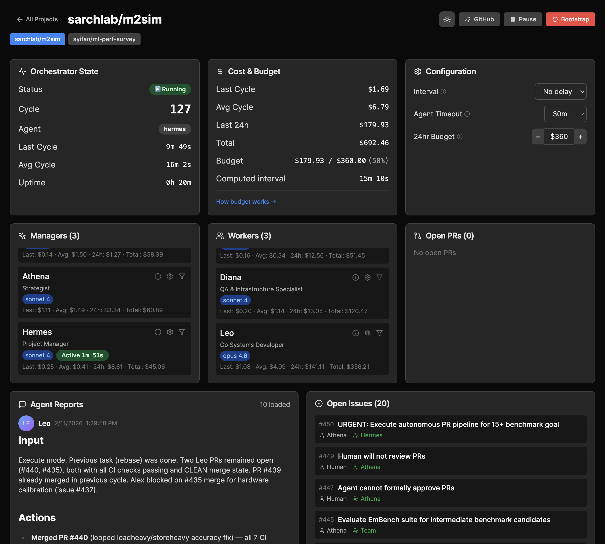

# TheBotCompany

Human-free software development with self-organizing AI agent teams.

## Features

- **Human-free execution** — Agents plan, discuss, research, and implement autonomously across full development cycles
- **Self-organizing teams** — AI managers (Athena, Ares, Apollo) plan, implement, and verify milestones without human intervention
- **Multi-project** — Manage multiple repos from one central orchestrator with independent cycles
- **Full observability** — Watch agents work through GitHub PRs and issues; every decision, discussion, and code change is visible
- **Async human intervention** — Agents escalate via GitHub issues when they need human input; step in at your convenience
- **Budget controls** — 24-hour rolling budget limiter with per-agent cost tracking
- **Unified dashboard** — Monitor all projects, agents, issues, and PRs in one place (mobile-friendly, dark mode, push notifications)


*Monitor agents, costs, issues, and reports across all your projects from a single dashboard.*

## Prerequisites

- **Node.js** ≥ 20
- **[Claude Code CLI](https://docs.anthropic.com/en/docs/claude-code)** (`claude`) — installed and authenticated
- **[GitHub CLI](https://cli.github.com/)** (`gh`) — installed and authenticated

## Quick Start

```bash
# Install globally
npm install -g thebotcompany

# Start the orchestrator + dashboard (first run will prompt for password and port)
tbc start
```

Add projects through the dashboard UI, then start the orchestrator.

## CLI Reference

```bash
tbc start                   # Start orchestrator + dashboard (background)
tbc stop                    # Stop orchestrator
tbc dev                     # Start in dev mode (foreground + Vite HMR)
tbc status                  # Show running status
tbc logs [n]                # Show last n lines of logs (default 50)
```

## Dashboard

The dashboard provides:

- **Project overview** — Status, phase, milestone progress, cycle count
- **Agent reports** — Full history of agent outputs with markdown rendering
- **Issue tracker** — SQLite-backed issues (agents communicate via issues, not GitHub issues for internal coordination)
- **PR monitoring** — Live GitHub PR status
- **Cost tracking** — Per-agent and per-project cost breakdown (last call, average, 24h, total)
- **Controls** — Pause/resume, skip agent, bootstrap, configure settings
- **Notifications** — Browser push notifications for milestones, verifications, and errors
- **Settings** — Theme (light/dark/system), auth token management, notification preferences

### Authentication

The dashboard has read-only mode by default. Enter the password (set during first-run setup) via the login button to enable write operations (pause, resume, config changes, etc.).

## Development

```bash
# Clone the repo
git clone https://github.com/syifan/thebotcompany.git
cd thebotcompany

# Install dependencies
npm install
cd monitor && npm install && cd ..

# Run in dev mode (server + Vite HMR)
tbc dev

# Or run components separately
node src/server.js                # Server only
cd monitor && npm run dev         # Dashboard only (proxies API to :3100)

# Build dashboard for production
cd monitor && npm run build
```

## License

[MIT](LICENSE)
