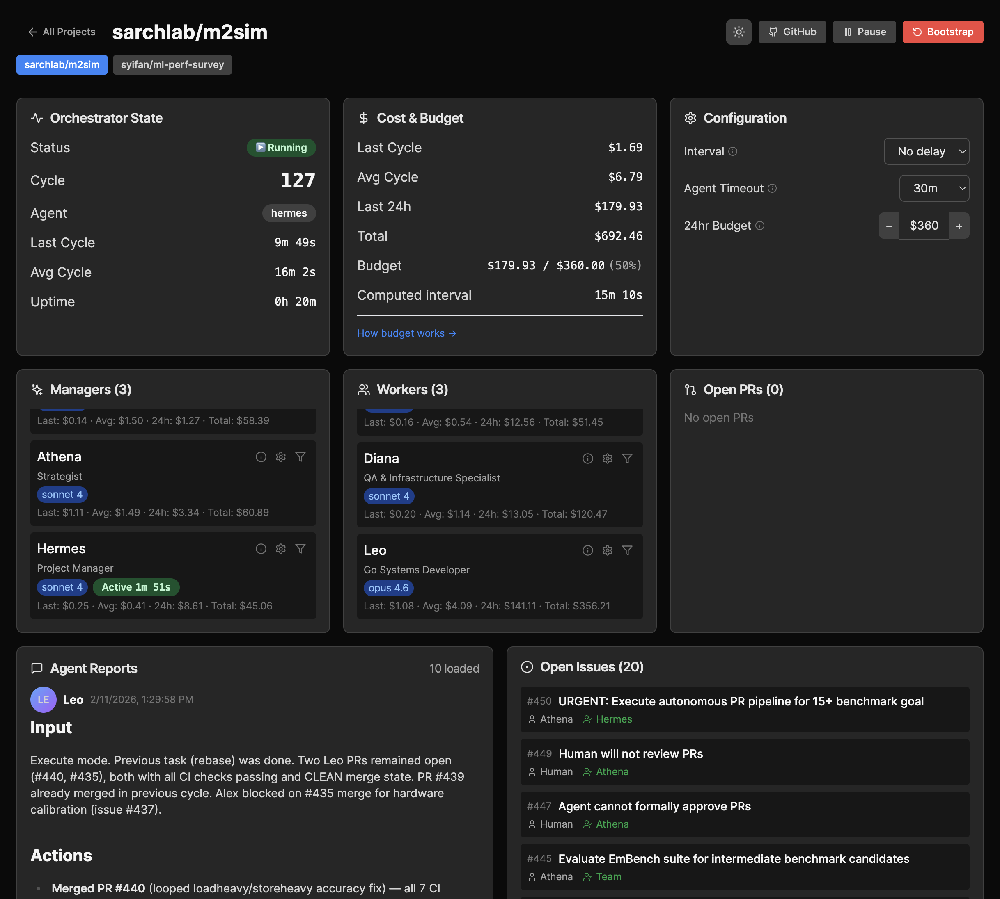

# TheBotCompany

Human-free software development with self-organizing AI agent teams.

## Features

- **Human-free execution** — Agents plan, discuss, research, and implement autonomously across full development cycles
- **Self-organizing teams** — AI managers (Athena, Ares, Apollo) plan, implement, and verify milestones without human intervention
- **Multi-project** — Manage multiple repos from one central orchestrator with independent cycles
- **Multi-provider** — Anthropic, OpenAI, Google, Groq, Mistral, xAI, Amazon Bedrock, Azure OpenAI, Cerebras, HuggingFace, MiniMax, OpenRouter, GitHub Copilot, Kimi Coding, and custom endpoints
- **Key pool** — Multiple API keys with priority ordering, automatic cross-provider fallback, and rate limit cooldowns
- **Full observability** — Every decision, discussion, and code change is visible through the dashboard and GitHub PRs
- **Chat** — Talk to agents directly through the dashboard with streaming responses and image support
- **Async human intervention** — Agents escalate via issues when they need human input; step in at your convenience
- **Budget controls** — 24-hour rolling budget limiter with per-agent cost tracking and computed sleep intervals
- **Unified dashboard** — Monitor all projects, agents, issues, and PRs in one place (mobile-friendly, dark mode, push notifications)


*Monitor agents, costs, issues, and reports across all your projects from a single dashboard.*

## Prerequisites

- **Node.js** ≥ 20
- **[GitHub CLI](https://cli.github.com/)** (`gh`) — installed and authenticated
- An API key from any supported provider (Anthropic, OpenAI, Google, etc.)

## Quick Start

```bash
# Install globally
npm install -g thebotcompany

# Start the orchestrator + dashboard (first run will prompt for password and port)
tbc start
```

Add your API key in Settings, create a project through the dashboard UI, then start the orchestrator.

## CLI Reference

```bash
tbc start                   # Start orchestrator + dashboard (background)
tbc stop                    # Stop orchestrator
tbc dev                     # Start in dev mode (foreground + Vite HMR)
tbc status                  # Show running status
tbc logs [n]                # Show last n lines of logs (default 50)
```

## Dashboard

The dashboard provides:

- **Project overview** — Status, phase, milestone progress, epoch/cycle count
- **Agent reports** — Full history of agent outputs with markdown rendering and auto-summarization
- **Agent issues** — SQLite-backed issue tracker for agent-to-agent coordination
- **Human intervention** — Separate panel for human↔agent escalation issues
- **Chat** — Direct conversation with agents per project, with streaming and image uploads
- **PR monitoring** — Live GitHub PR status per project
- **Cost tracking** — Per-agent and per-project cost breakdown (last cycle, average, 24h, total)
- **Controls** — Pause/resume, skip sleep, kill run/cycle/epoch, bootstrap
- **Key pool management** — Add/remove/reorder API keys, OAuth sign-in, per-project key selection with fallback control
- **Model tier overrides** — Customize which model runs at each tier (high/mid/low/xlow) per project
- **Notifications** — Browser push notifications for milestones, verifications, and errors
- **Settings** — Theme (light/dark/system), credential management, notification preferences

### Authentication

The dashboard has read-only mode by default. Enter the password (set during first-run setup) via the login button to enable write operations (pause, resume, config changes, etc.).

## Configuration

### Environment Variables

| Variable | Default | Description |
|----------|---------|-------------|
| `TBC_PASSWORD` | *(set on first run)* | Password for write access to the dashboard |
| `TBC_PORT` | `3100` | Server port |
| `TBC_HOME` | `~/.thebotcompany` | Data directory (keys, DB, logs) |
| `TBC_SERVE_STATIC` | `true` | Serve the built dashboard frontend |
| `TBC_ALLOW_CUSTOM_PROVIDER` | `false` | Enable custom provider support (see [Security](#custom-provider)) |

### API Keys

API keys can be added through the dashboard Settings panel. Alternatively, set environment variables for auto-detection on first run:

```bash
ANTHROPIC_API_KEY=sk-ant-...
OPENAI_API_KEY=sk-...
GEMINI_API_KEY=...
```

The key pool supports multiple keys per provider with automatic fallback when a key hits rate limits.

### Supported Providers

| Provider | Auth Methods |
|----------|-------------|
| Anthropic | API key, OAuth |
| OpenAI | API key, OAuth |
| Google (Gemini) | API key, OAuth |
| GitHub Copilot | OAuth |
| Amazon Bedrock | API key |
| Azure OpenAI | API key |
| Cerebras | API key |
| Google Vertex | API key |
| Groq | API key |
| Hugging Face | API key |
| Kimi Coding | API key |
| MiniMax | API key |
| Mistral | API key |
| OpenRouter | API key |
| xAI | API key |
| Custom | API key (OpenAI or Anthropic compatible) |

## Security

### Authentication & Authorization

- **Password-protected writes** — All mutating API endpoints require authentication via `TBC_PASSWORD`. Read-only access (viewing projects, logs, reports) does not require auth.
- **CORS** — API only accepts requests from the dashboard origin (`localhost:<port>`).

### Custom Provider

The custom provider feature allows connecting to any OpenAI-compatible or Anthropic-compatible API endpoint. This introduces a server-side request forwarding (SSRF) surface since TBC's server makes HTTP requests to the user-specified `baseUrl`.

**Built-in protections:**

- **Private IP blocklist** — `baseUrl` is validated and rejected if it points to:
  - Localhost (`127.0.0.1`, `::1`, `localhost`)
  - RFC1918 private ranges (`10.0.0.0/8`, `172.16.0.0/12`, `192.168.0.0/16`)
  - Link-local addresses (`169.254.0.0/16`)
  - Cloud metadata endpoints (`169.254.169.254`, `metadata.google.internal`)
- **Protocol restriction** — Only `http://` and `https://` URLs are accepted.
- **Auth-gated** — Creating or editing custom credentials requires write authentication.

The custom provider is **disabled by default**. To enable it:

```bash
# In your .env or environment
TBC_ALLOW_CUSTOM_PROVIDER=true
```

When disabled, custom credential creation is blocked at the API level and the option is hidden from the UI.

> **Note:** The hostname blocklist does not protect against DNS rebinding attacks (where an external hostname resolves to a private IP). For maximum security on shared instances, keep `TBC_ALLOW_CUSTOM_PROVIDER` disabled (the default).

## Development

```bash
# Clone the repo
git clone https://github.com/syifan/thebotcompany.git
cd thebotcompany

# Install dependencies
npm install
cd monitor && npm install && cd ..

# Run in dev mode (server + Vite HMR)
tbc dev

# Or run components separately
node src/server.js                # Server only
cd monitor && npm run dev         # Dashboard only (proxies API to :3100)

# Build dashboard for production
cd monitor && npm run build

# Run tests
npm test
```

## License

[MIT](LICENSE)
